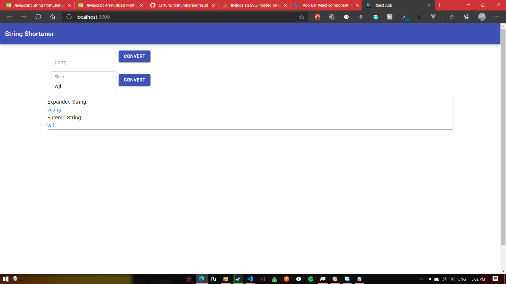

# String Shortener

<a href=''>Live Demo</a>

## Tech Stack 


## Table of Contents

- [Description](#description)
- [Getting Started](#getting-started)
- [Dependencies](#dependencies)
- [Example](#example)
- [Test Cases](#test-cases)
- [Code Section](#code-section)
   -[Shortener](#shortener)
   -[Expander](#expander)


## Description 

This project is the second assignment from proedge skill development and edutech, to develop a frontend app for String shortening without the use of any external libraries, however I have used material-Ui library for visualization.

## Getting started

clone this repo : 

```
Run " npm i " in the root folder

```

## Dependencies 

<a href='https://material-ui.com/getting-started/installation/'>Material UI core</a>
<a href='https://material-ui.com/components/about-the-lab/'>Material UI lab</a>
<a href='https://material-ui.com/components/material-icons/'>Material UI Icons</a>

## Example



## Code Section

### Shortener

#### Validate the Strings

Check if a string is entered
```
if(!string){
            setError('Field cannot be empty')
            setCloseError(false)
            return false
        }
        return true

```

#### Find an existing shortened string
```
 const savedString = JSON.parse(localStorage.getItem('strings')) 
        if(savedString){
        const existingString = savedString.find((element) => {
            const [foundElement] = Object.values(element)
            if(foundElement === originalString){
                return foundElement
            }
            return undefined
        })

        if(existingString) {
            return setShortenedString(existingString)
            }
        }
        
```
#### Convert to words to its ASCII code exquivalent and increment  

```
const asciiCodeOfText = originalString.split('').map((word) => word.charCodeAt(0))
        const newCodes = asciiCodeOfText.map((code) => {
            const newCode = code + 1
            return newCode
        })
```

#### Validation for unique Strings

```
 const shortened = () => {
        // newCodes.map((code) => String.fromCharCode(code)).join('').slice(0, originalString.length / 2 )
            const editCode = newCodes.map((code) => String.fromCharCode(code)).join('')
            const newcode1 = editCode.slice( 0, originalString.length / 2 )
            const newcode2 = editCode.slice( originalString.length / 2, originalString.length - 1 )
            
            if(savedString){
                const existingShortened = savedString.find((element) => {
                    const [foundString] = Object.keys(element)
                    if(foundString){
                        return foundString
                    }
                    return undefined
                })
    
                if(existingShortened){
                    return newcode2
                }
    
                return newcode1
            }
            return newcode1
        } 

```

### Expander

#### Validations for the expander string

```
 if( validate(shortString) === false) {
                return
            }
        const savedStrings = JSON.parse(localStorage.getItem('strings')) 
        if(!savedStrings){
            setCloseError(false)
            return setError('no matches found')
        }
```

#### Set the expanded string

```
 const existingString = savedStrings.find((element) => { 
       const [foundElement] = Object.keys(element)
        if(foundElement === shortString){
            return foundElement
        }
        return undefined
       })

       if(existingString){
            return setExpanedString(existingString)
       }
       return setError('No match for the entered string')

```

